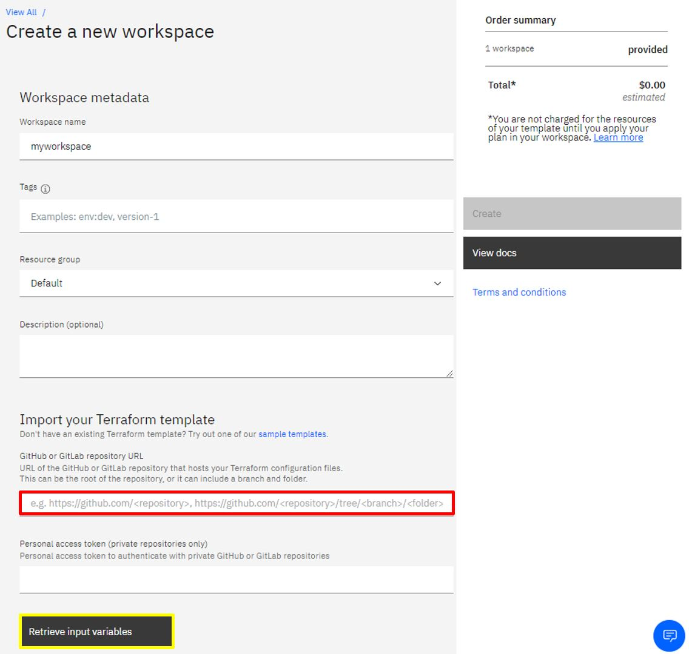
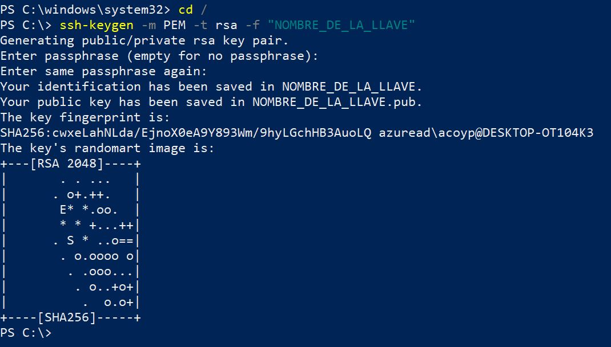
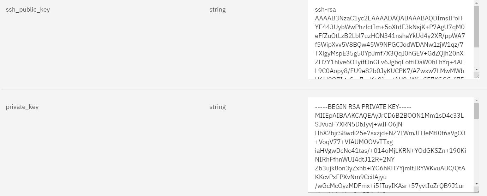
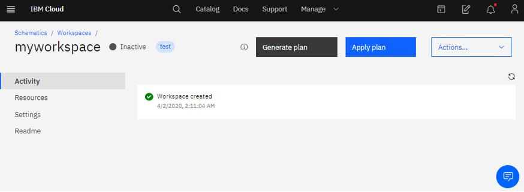

# Virtual Server - Aprovisionamiento y configuración con Terraform y Puppet :cloud:

En esta guía encontrará una descripción detallada sobre el aprovisionamiento de una VSI en IBM cloud mediante Schematics y la configuración de Apache en esta, integrando Terraform con Puppet el cual es un gestor de configuraciones.


### Indice:
1. [Archivos Terraform](#1-archivos-terraform)
- [Archivos](#archivos-bookmark_tabs)
- [Variables](#variables-)
2. [Configuración de puppet](#2-configuración-de-puppet)
3. [Despliegue en Schematics](#3-despliegue-en-schematics-wrench)
4. [Resultados](#resultados--computer)
5. [Referencias](#referencias--mag)


## 1. Archivos Terraform 

Terraform es una herramienta de aprovisionamiento de infraestructura que utiliza aprovisionadores, en este caso se hace uso del aprovisionador de ejecución remota para correr un conjunto de comandos externos de manera remota en la máquina recién creada. De esta forma se configura Puppet Master y se automatiza la creación de un servidor Apache HTTP Server en la maquina.

### Archivos :bookmark_tabs:

Para el aprovisionamiento de una VSI se requiere de mínimo tres archivos .tf de configuración los cuales son:
- variable.tf = Contiene las variables de llaves y nombres unicos que el cliente introduce en su servicio
- main.tf = Archivo principal que contiene las funciones de aprovisionamiento de recursos 
- provider.tf = Instalador de provider IBM sobre Schematics


### Variables 📋

El aprovisionamiento de un VSI :

| Variable | Información |
| ------------- | ------------- |
| **ibmcloud_apikey**  | [API key](https://cloud.ibm.com/docs/iam?topic=iam-userapikey) unica del usuario que se requiere para aprovisionamiento de recursos |
| **hostname**  | Nombre de la VSI a aprovisionar |
| **domain**  | Dominio del recurso a aprovisionar |
| **datacenter**  | Datacenter donde se aprovisionará el recurso VSI |
| **os_reference**  | Referencia de Sistema Operativo del Servidor Virtual |
| **network_speed**  | Velocidad de red de conexión del recurso () |
| **hourly_billing**  | Tipo de facturación de la VSI _**true** = facturación por horas_ o _**false** = facturación mensual_ |
| **network_mode**  | Tipo de conexión a la red _**true** = Red unicamente privada_ o _**false** = Red publica y privada_ |
| **cores**  | Configuración de nucleos de la VSI |
| **memory**  | Memoria RAM de la VSI **Gigas de memoria RAM * 1024** ---- EJ : _2 Gb = 2048_ / _10 Gb = 10240_|z
| **ssh_public_key**  | Llave publica generada. Mas información: https://www.ssh.com/ssh/keygen/ |
| **private_key**  | Llave privada generada. Mas información: https://www.ssh.com/ssh/keygen/ |
| **repo_git**  | Dirección URL del repositorio en GitHub que contiene el archivo MANIFEST de configuración |
| **repo_name**  | Nombre del repositorio que contiene el MANIFEST de configuración Puppet |
| **puppet_file**  | Nombre del archivo MANIFEST con extensión **.pp** de la configuración Puppet |

## 2. Configuración de Puppet

Para esta guía se hace uso de _puppet aply_, que permite aplicar manifiestos de la herramienta de administración de configuraciones Puppet de forma local  en la máquina que va a ser aprovisionada mediante Terraform.

Para su configuración e instalación se agregan las siguientes líneas de código dentro de la plantilla de Terraform en la sección _Remote_exec_ del archivo main.tf.
```sh
"yes | sudo apt-get update", 
      "yes | sudo apt install puppetmaster",
      "git clone ${var.repo_git}",
      "cd ${var.repo_name}",
      "puppet apply ${var.puppet_file}"
```

Una vez se instala y configura Puppet master en la máquina se procede a aplicar el manifest de Puppet localmente con el siguiente comando.
```sh
puppet apply manifest.pp
```
Teniendo en cuenta que manifest.pp es el nombre del archivo donde se encuentran las configuraciones que van a ser aplicadas a al virtual server aprovisionado. Para tener más información sobre las posibles configuraciones locales diríjase a la página de [Puppet](https://puppet.com/docs/puppet/latest/man/apply.html).

## 3. Despliegue en Schematics :wrench: 

Se debe dirigir al simbolo de menú en donde encontrará la opción de **Schematics** una vez alli se creará un nuevo workspace donde se contará con la siguiente pestaña:

 

Para la configuración de la SSH Keys se debe abrir la terminar del PC en ingresar el comando 
```sh
ssh-keygen -m PEM -t rsa -f <NOMBRE_DE_LA_LLAVE>
```


Al ejecutar el comando se crearan dos archivos. Uno de ellos con extensión .pub cuyo contenido de texto contiene una llave SSH publica. El otro archivos no tiene extensión y contiene la llave SSH privada. Se deben copiar y pegar cada una de ellas en las variables definidas anteriormente.

Luego de tener estas llaves se agregan a las variables de entrada como se muestra a continuación:



En el espacio sobremarcado con rojo se debe pegar el link del repositorio y de ser necesario en la parte de abajo el Token para permisos de acceso. Se presiona el botón sobremarcado con amarillo para adquirir las variables a rellenar. Luego de rellenarlas se debe crear el workspace. En caso de realizar el procedimiento de forma correcta se contará con la siguiente pestaña:



Se debe generar el plan con el botón que aparece en pantalla y de generarse correctamente se podrá aplicar el plan. _Solo hasta aplicar el plan se va a generar facturación_

## Resultados  :computer: 

## Referencias  :mag: 

Encuentre información sobre terraform en IBM cloud en: [Managing IBM Cloud resources with Terraform](https://cloud.ibm.com/docs/terraform?topic=terraform-manage_resources)
<br>
Encuentre información sobre Puppet en: [Learn Puppet ](https://puppet.com/docs/puppet/latest/puppet_index.html)
<br>

## Autores :black_nib:
IBM Cloud Tech Sales
